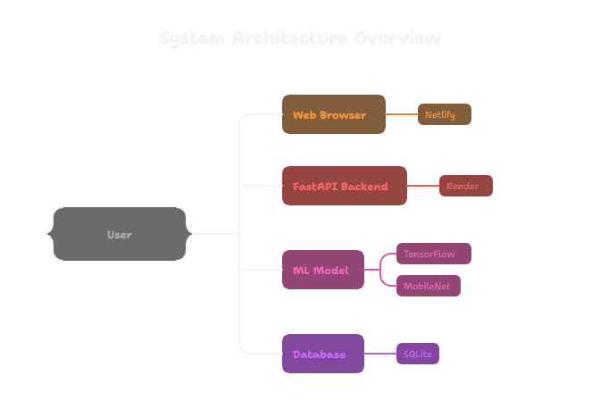
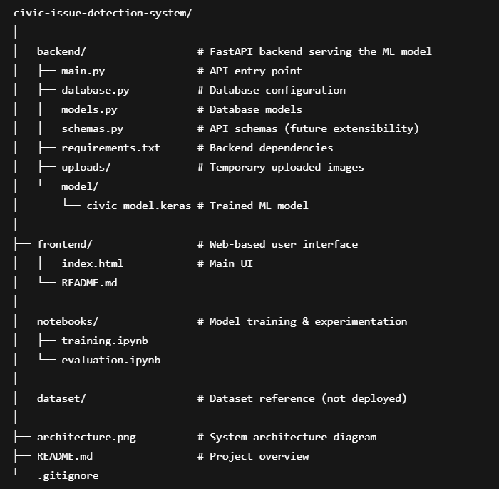

# Civic Issue Detection System (ML Module)

This repository contains an **ML-powered civic issue detection module** developed as a core component of a larger Final Year Project on Civic Analytics.

The module classifies civic issues from images using a deep learning model and exposes predictions via a REST API, which is consumed by a web frontend.

---

## Features

- Image-based civic issue classification
- Supports 4 civic issue categories:
  - Garbage
  - Potholes
  - Fallen Trees
  - Damaged Electric Poles
- Handles unknown / irrelevant images safely using confidence thresholding
- REST API for model inference
- Web-based frontend for real-time testing
- Fully deployed backend & frontend

---

## Tech Stack

### Machine Learning
- Python
- TensorFlow / Keras
- CNN (Transfer Learning – MobileNet)

### Backend
- FastAPI
- SQLAlchemy
- SQLite
- REST API
- Render (Deployment)

### Frontend
- HTML
- CSS
- JavaScript
- Axios
- Netlify (Deployment)

---

## System Architecture

### Architecture Overview

The system follows a modular client–server architecture.  
The frontend is a lightweight web interface responsible for image upload and result visualization.  
It communicates with the backend via RESTful APIs.

The backend, built using FastAPI, handles image preprocessing, model inference, and decision logic.  
A trained deep learning model performs image classification, while confidence thresholding is applied to safely handle unknown inputs.  
Prediction results are optionally stored in a database for future analysis.

This modular design allows the ML component to be easily integrated into a larger civic analytics system.

---

## Live Demo

- **Frontend:** https://civic-issue-detection.netlify.app
- **Backend API Docs:** https://civic-ml-api.onrender.com/docs

---

## Repository Structure

---

## Academic Context

This project represents the **Machine Learning module** of a larger Final Year Project focused on **Civic Issue Analytics**.  
The ML module is responsible for real-time image classification and is designed to integrate seamlessly with other system components.

---

## Author

**Nishant Bayaskar**  
Final Year B.E. Student  
Machine Learning & Data Analytics

